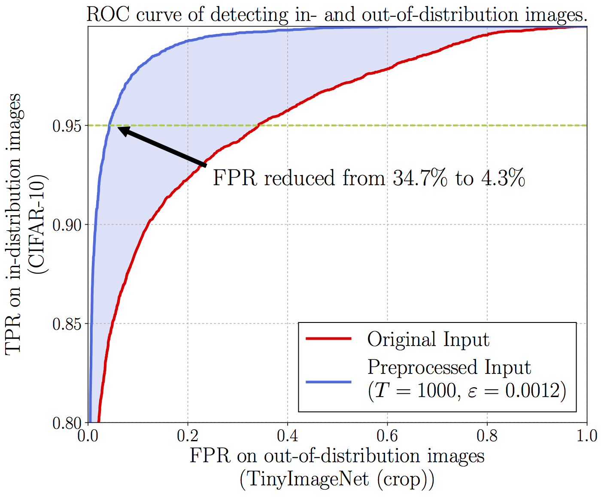
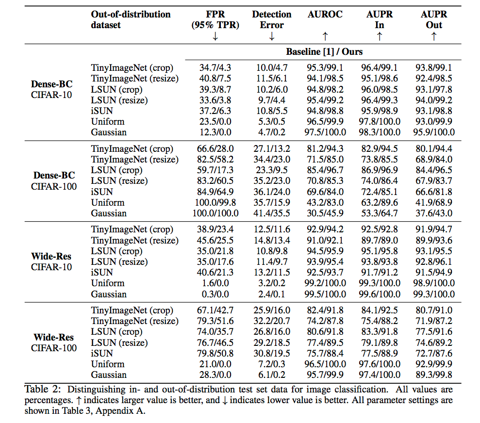

# ODIN: Out-of-Distribution Detector for Neural Networks


This is a [PyTorch](http://pytorch.org) implementation for detecting out-of-distribution examples in neural networks. The method is described in the paper [Enhancing The Reliability of Out-of-distribution Image Detection in Neural Networks](https://arxiv.org/abs/1706.02690) by S. Liang, [Yixuan Li](www.yixuanli.net) and [R. Srikant](https://sites.google.com/a/illinois.edu/srikant/). The method reduces the false positive rate from the baseline 34.7% to 4.3% on the DenseNet (applied to CIFAR-10) when the true positive rate is 95%.
<p align="center">

</p>


## Experimental Results

We used two neural network architectures, [DenseNet-BC](https://arxiv.org/abs/1608.06993) and [Wide ResNet](https://arxiv.org/abs/1605.07146).
The PyTorch implementation of [DenseNet-BC](https://arxiv.org/abs/1608.06993) is provided by [Andreas Veit](https://github.com/andreasveit/densenet-pytorch) and [Brandon Amos](https://github.com/bamos/densenet.pytorch). The PyTorch implementation of [Wide ResNet](https://arxiv.org/abs/1605.07146) is provided  by [Sergey Zagoruyko](https://github.com/szagoruyko/wide-residual-networks).
The experimental results are shown as follows. The definition of each metric can be found in the [paper]().



## Pre-trained Models

We provide four pre-trained neural networks: (1) two [DenseNet-BC](https://arxiv.org/abs/1608.06993) networks trained on  CIFAR-10 and CIFAR-100 respectively; (2) two [Wide ResNet](https://arxiv.org/abs/1605.07146) networks trained on CIFAR-10 and CIFAR-100 respectively. The test error rates are given by:

Architecture    |  CIFAR-10   | CIFAR-100
------------    |  ---------  | ---------
DenseNet-BC     |  4.81       | 22.37
Wide ResNet     |  3.71       | 19.86


## Running the code

### Dependencies

* CUDA 8.0
* PyTorch
* Anaconda2 or 3
* At least **three** GPU

	**Note:** Reproducing results of DenseNet-BC only requires **one** GPU, but reproducing results of Wide ResNet requires **three** GPUs. Single GPU version for Wide ResNet will be released soon in the future.  

### Downloading  Out-of-Distribtion Datasets
We provide download links of five out-of-distributin datasets:

* **[Tiny-ImageNet (crop)](https://www.dropbox.com/s/avgm2u562itwpkl/Imagenet.tar.gz)**
* **[Tiny-ImageNet (resize)](https://www.dropbox.com/s/kp3my3412u5k9rl/Imagenet_resize.tar.gz)**
* **[LSUN (crop)](https://www.dropbox.com/s/fhtsw1m3qxlwj6h/LSUN.tar.gz)**
* **[LSUN (resize)](https://www.dropbox.com/s/moqh2wh8696c3yl/LSUN_resize.tar.gz)**
* **[iSUN](https://www.dropbox.com/s/ssz7qxfqae0cca5/iSUN.tar.gz)**

Here is an example code of downloading Tiny-ImageNet (crop) dataset. In the **root** directory, run

```
mkdir data
cd data
wget https://www.dropbox.com/s/avgm2u562itwpkl/Imagenet.tar.gz
tar -xvzf Imagenet.tar.gz
cd ..
```

### Downloading Neural Network Models

We provide download links of four pre-trained models.

* **[DenseNet-BC trained on CIFAR-10](https://www.dropbox.com/s/wr4kjintq1tmorr/densenet10.pth.tar.gz)**
* **[DenseNet-BC trained on CIFAR-100](https://www.dropbox.com/s/vxuv11jjg8bw2v9/densenet100.pth.tar.gz)**
* **[Wide ResNet trained on CIFAR-10](https://www.dropbox.com/s/uiye5nw0uj6ie53/wideresnet10.pth.tar.gz)**
* **[Wide ResNet trained on CIFAR-100](https://www.dropbox.com/s/uiye5nw0uj6ie53/wideresnet100.pth.tar.gz)**

Here is an example code of downloading DenseNet-BC trained on CIFAR-10. In the **root** directory, run

```
mkdir models
cd models
wget https://www.dropbox.com/s/wr4kjintq1tmorr/densenet10.pth.tar.gz
tar -xvzf densenet10.pth.tar.gz
cd ..
```


### Running

Here is an example code reproducing the results of DenseNet-BC trained on CIFAR-10 where TinyImageNet (crop) is the out-of-distribution dataset. The temperature is set as 1000, and perturbation magnitude is set as 0.0014. In the **root** directory, run

```
cd code
# model: DenseNet-BC, in-distribution: CIFAR-10, out-distribution: TinyImageNet (crop)
# magnitude: 0.0014, temperature 1000, gpu: 0
python main.py --nn densenet10 --out_dataset Imagenet --magnitude 0.0014 --temperature 1000 --gpu 0
```
**Note:** Please choose arguments according to the following.

#### args
* **args.nn**: the arguments of neural networks are shown as follows

	Nerual Network Models | args.nn
	----------------------|--------
	DenseNet-BC trained on CIFAR-10| densenet10
	DenseNet-BC trained on CIFAR-100| densenet100
* **args.out_dataset**: the arguments of out-of-distribution datasets are shown as follows

	Out-of-Distribution Datasets     | args.out_dataset
	------------------------------------|-----------------
	Tiny-ImageNet (crop)                | Imagenet
	Tiny-ImageNet (resize)              | Imagenet_resize
	LSUN (crop)                         | LSUN
	LSUN (resize)                       | LSUN_resize
	iSUN                                | iSUN
	Uniform random noise                | Uniform
	Gaussian random noise               | Gaussian

* **args.magnitude**: the optimal noise magnitude can be found below. In practice, the optimal choices of noise magnitude are model-specific and need to be tuned accordingly.

	Out-of-Distribution Datasets        |   densenet10     |  densenet100  | wideresnet10   | wideresnet100
	------------------------------------|------------------|-------------  | -------------- |--------------
	Tiny-ImageNet (crop)                | 0.0014           | 0.0014        | 0.0005           | 0.0028
	Tiny-ImageNet (resize)              | 0.0014           | 0.0028        | 0.0011           | 0.0028
	LSUN (crop)                         | 0                | 0.0028        | 0                | 0.0048
	LSUN (resize)                       | 0.0014           | 0.0028        | 0.0006           | 0.002
	iSUN                                | 0.0014           | 0.0028        | 0.0008           | 0.0028
	Uniform random noise                | 0.0014           | 0.0028        | 0.0014           | 0.0028
	Gaussian random noise               | 0.0014           |0.0028         | 0.0014           | 0.0028

* **args.temperature**: temperature is set to 1000 in all cases.
* **args.gpu**: make sure you use the following gpu when running the code:

	Neural Network Models |  args.gpu
	----------------------|----------
	densenet10            | 0
	densenet100           | 0
	wideresnet10          | 1
	wideresnet100         | 2

### Outputs
Here is an example of output.

```
Neural network architecture:          DenseNet-BC-100
In-distribution dataset:                     CIFAR-10
Out-of-distribution dataset:     Tiny-ImageNet (crop)

                          Baseline         Our Method
FPR at TPR 95%:              34.8%               4.3%
Detection error:              9.9%               4.6%
AUROC:                       95.3%              99.1%
AUPR In:                     96.4%              99.2%
AUPR Out:                    93.8%              99.1%
```

### License
Please refer to the [LICENSE](https://github.com/facebookresearch/odin/blob/master/LICENSE).
